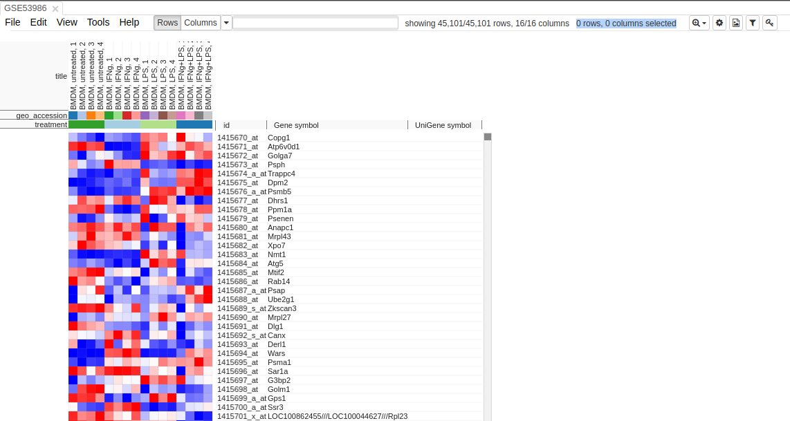
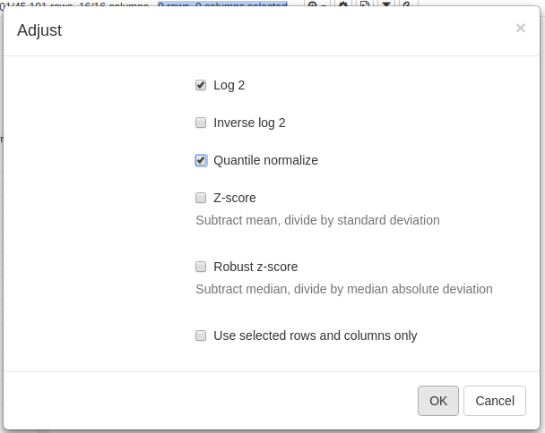
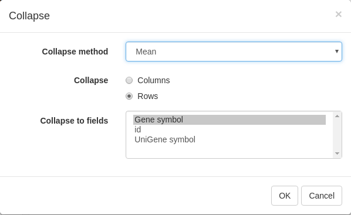
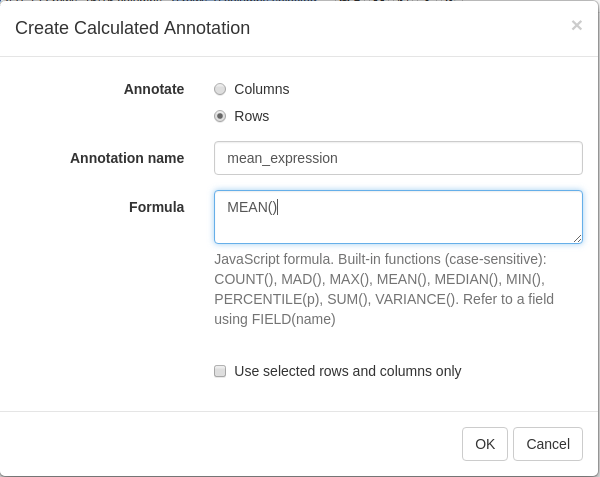
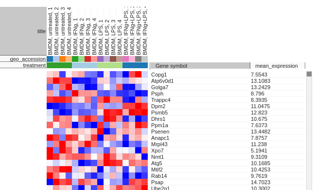
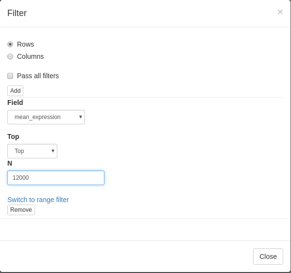

This is an extended version of the project Morpheus. We are integrating widely used gene epression analysis methods from Bioconductor. You can use it in multiple ways, either locally, using servePhantasus-function from this package, this way would be described in this tutorial, either on [web-site](https://artyomovlab.wustl.edu/phantasus).

## Loading additional libraries

That package needs GEOquery as a dependency. Although, we recommend to install this package from it's forked version due to its better cache support:
```{r,eval=FALSE}
devtools::install_github('assaron/GEOquery')
```

## Running

To run this package use its exported function:
```{r,eval=FALSE}
library(phantasus)
servePhantasus('0.0.0.0', 8000, cacheDir = file.path(getwd(), 'cache'))
```
Then, open (http://localhost:8000) at your browser.

## Loading a dataset for analysis

There are two ways to upload a dataset into application:

- As a file from
    - computer;
    - URL;
    - Dropbox;
- By GEO identifier.

## Workflow example with GSE53986

### Prepare the dataset for analysis

#### Open the dataset

Choose a loading option "GEO Datasets" and put "GSE53986" in the input field. 
After a few seconds, corresponding heatmap will be loaded. 
```{r, out.width = "750px", echo = FALSE}

```

#### Adjust values

As you can see on the image, values are not scaled. So for the proper further analysis it is recommended to rescale the series matrix.
```{r, out.width = "750px", echo = FALSE}

```

To adjust values go to Tools/Adjust and use Log2 and Quantile Normalization.
```{r, out.width = "500px", echo = FALSE}

```

#### Remove duplicates

There can be duplicated genes, it is important to collapse their values.

```{r, out.width = "600px", echo = FALSE}

```

For that go to Tools/Collapse and choose "Mean" as the method and "Gene Symbol" as the collapse field.

```{r, out.width = "500px", echo = FALSE}

```

#### Filter lowly expressed genes

To calculate mean expression of each gene go to Tools/Create Calculated Annotation.

Put there annotation name and formula for calculation.

```{r, out.width = "500px", echo = FALSE}

```

The result should look like this, now you can use this annotation to sort genes by:

```{r, out.width = "600px", echo = FALSE}

```

To filter genes go to Tools/Filter, press "Add", choose "mean_expression" as the field, then press to "Switch to top filter", and input the number of genes you want to proceed with.

```{r, out.width = "500px", echo = FALSE}

```

Then you can close tool, the added filter will be still active. Although it is more convenient to extract this genes to a new dataset, so select all genes (click on any gene and press Ctrl+A) and use Tools/New Heat Map (Ctrl+X).

### Explore the dataset

#### PCA Plot

Use Tools/PCA Plot to analyse the data with Principal Component Analysis method. 

```{r, out.width = "550px", echo = FALSE}
knitr::include_graphics("images/pcaplot_tool_clean.png")
```

#### Kmeans clusterization

#### Hierarchical clustering

#### Differential expression


