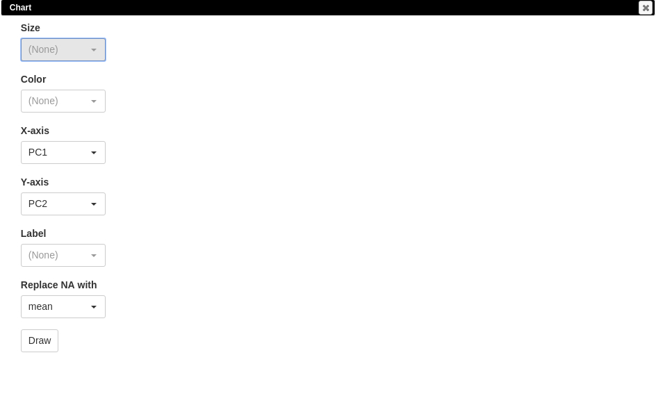
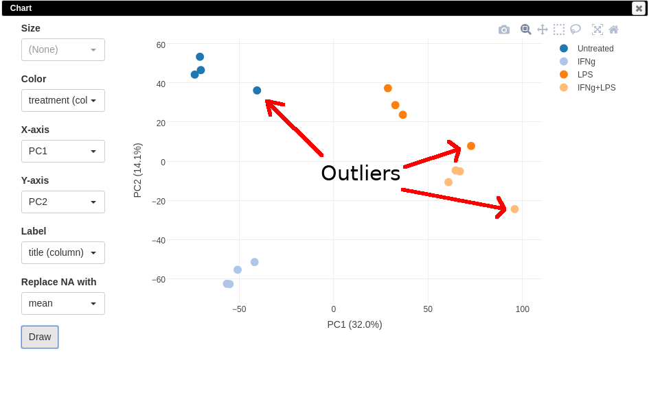
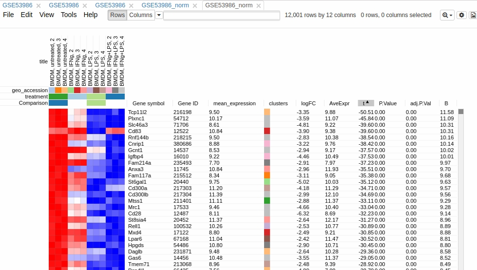

This is an extended version of the project Morpheus. 
We are integrating widely used gene expression analysis methods 
from Bioconductor. You can use it in multiple ways, either locally, 
using `servePhantasus`-function from this package, this way would be 
described in this tutorial, 
either on [web-site](https://artyomovlab.wustl.edu/phantasus).

## Quick start

### Start application

To run this package use its exported function:
```{r,eval=FALSE}
library(phantasus)
servePhantasus()
```
This command will run the application with default parameters, open it in your default browser (from `browser` option) with address http://0.0.0.0:8000. 

### Workflow example with GSE53986

To illustrate the usage of Phantasus we use dataset [GSE53986](https://www.ncbi.nlm.nih.gov/geo/query/acc.cgi?acc=GSE53986) from GEO database with multiple treatments of bone marrow derived macrophages

#### Prepare the dataset for analysis

**Open the dataset**

Choose a loading option "GEO Datasets" and put "GSE53986" in the input field. 
After a few seconds, corresponding heatmap will be loaded. 

```{r, out.width = "750px", echo = FALSE}
knitr::include_graphics("images/dataset_loaded.jpg")
```


**Adjust values**

As you can see on the image, values are not normalized. 
So for the proper further analysis it is recommended to normalize the 
series matrix.

```{r, out.width = "500px", echo = FALSE}
knitr::include_graphics("images/huge_value.jpg")
```

To normalize values go to Tools/Adjust and use Log2 and Quantile Normalization.

```{r, out.width = "500px", echo = FALSE}
knitr::include_graphics("images/adjust_tool.jpg")
```

The new tab will appear representing the normalized dataset as the product of Adjust tool.


**Remove duplicates**

There can be duplicated genes, it is important to collapse their values.

```{r, out.width = "600px", echo = FALSE}
knitr::include_graphics("images/duplicates.jpg")
```

For that go to Tools/Collapse and choose "Maximum Median Probe" as the method and 
"Gene ID" as the collapse field.

```{r, out.width = "500px", echo = FALSE}
knitr::include_graphics("images/collapse_tool.jpg")
```

The result will be shown in a new tab. 


**Filter lowly expressed genes**

To calculate mean expression of each gene go to 
Tools/Create Calculated Annotation.

Put there annotation name and formula for calculation.

```{r, out.width = "500px", echo = FALSE}
knitr::include_graphics("images/calculated_annotation_tool.jpg")
```

The result will appear as additional row annotation, now you can use this annotation 
to sort genes by:

```{r, out.width = "600px", echo = FALSE}
knitr::include_graphics("images/calculated_annotation_loaded.jpg")
```

To filter genes go to Tools/Filter, press "Add", choose "mean_expression" 
as the field, then press to "Switch to top filter", and input the number 
of genes you want to proceed with.

Then you can close tool, the added filter will be still active. 

```{r, out.width = "500px", echo = FALSE}
knitr::include_graphics("images/filter_tool.jpg")
```

Now in the same tab only filtered genes are displayed.
As you can see on the image, Filter tool has left 12001 genes, not 12000. That happens because some genes have the equivalent mean_expression value.

```{r, out.width = "500px", echo = FALSE}
knitr::include_graphics("images/filter_tool_result.jpg")
```

It is more convenient to extract this genes to a new dataset, 
so select all genes (click on any gene and press Ctrl+A) and 
use Tools/New Heat Map (Ctrl+X).

Now you have the tab with fully prepared dataset for the further analysis. To easily distinguish it from other tabs, you can rename it by right click on the tab and choosing "Rename". We will call it "GSE53986_norm".

It's also useful to save the current result to be able to return to it in some time. In order to save it use File/Save Dataset, input name and press OK.

#### Explore the dataset

**PCA Plot**

Use Tools/PCA Plot to analyse the data with 
Principal Component Analysis method. 

```{r, out.width = "550px", echo = FALSE}

```

You can customize color, size and label of points on the chart 
by values in annotation. By analysing the plot you may find some outliers 
that need to be analysed further to see if they can be eliminated.

```{r, out.width = "550px", echo = FALSE}

```

**K-means clustering**

Use Tools/k-means to cluster genes into predefined number of clusters.

```{r, out.width = "500px", echo = FALSE}
knitr::include_graphics("images/kmeans_tool.jpg")
```

Then you can sort by annotation "clusters" and view the whole dataset 
by using View/Fit to window. Here you can also see outlier samples.

```{r, out.width = "600px", echo = FALSE}
knitr::include_graphics("images/kmeans_result.jpg")
```

**Hierarchical clustering**

Use Tool/Hierarchical clustering to cluster samples. 

```{r, out.width = "500px", echo = FALSE}
knitr::include_graphics("images/hierarchical_tool.jpg")
```

**Filtering outliers**

Now, when outliers are confirmed and easily viewed with the dendrogram from the previous step, you can choose only good samples 
and extract them into another heatmap (Ctrl+X).

```{r, out.width = "600px", echo = FALSE}
knitr::include_graphics("images/good_samples.jpg")
```

**Differential expression**

Use Tools/Limma to compare samples. Choose "treatment" as a field, 
"Untreated" and "LPS" as classes.

```{r, out.width = "500px", echo = FALSE}
knitr::include_graphics("images/limma_tool.jpg")
```

Now you can sort by t-statistic and see genes with the highest difference 
between classes.

```{r, out.width = "600px", echo = FALSE}

```

**Shiny GAM analysis**

After differential expression you can submit current dataset to Shiny Gam analysis. Use Tools/Sumbit to Shiny GAM.

```{r, out.width = "300px", echo = FALSE}
knitr::include_graphics("images/shiny_gam.jpg")
```

Result will open in a new browser tab.

```{r, out.width = "600px", echo = FALSE}
knitr::include_graphics("images/shiny_gam_result.jpg")
```

## Additional settings 

### Recommended dependencies

That package needs GEOquery as a dependency. Although, we recommend to install 
this package from it's forked version due to its better cache support:
```{r,eval=FALSE}
devtools::install_github('assaron/GEOquery')
```

### Advanced options for `servePhantasus`

You can customise serving of the application with specifying following parameters:

- host and port (by default '0.0.0.0' and 8000);
- cache directory (by default tempdir()) -- directory where downloaded datasets will be saved and they can be reused in new sessions;
- preloaded directory (by default NULL) -- directory with ExpressionSets encoded in rda-files, that can be quickly loaded to application by name;
- openInBrowser (by default TRUE).

### Loading dataset options

There are three ways to upload a dataset into application:

- As a file from
    - computer;
    - URL;
    - Dropbox;
- By GEO identifier
    - with "Open file" interface;
    - with adding parameter "geo" to the link (e.g. http://localhost:8000/?geo=GSE27112).
- By specified name (provider must specify it for you)
    - with "Saved on server datasets"
    - with adding parameter "preloaded" to the link (e.g. http://localhost:8000/?preloaded=fileName)
    
You can either open the dataset from the main page, or if you are already looking at some datasets and don't want to lose your progress you can use File/Open (Ctrl+O) choose "Open dataset in new tab" and then choose the opening option.

```{r, out.width="500px", echo = FALSE}
knitr::include_graphics("images/open_file_tool.jpg")
```


## Feedback

You can see known issues and place yours here:
(https://github.com/ctlab/phantasus/issues)
