This tutorial describes Phantasus -- a web-application for visual and interactive gene expression analysis.
Phantasus is based on 
[Morpheus](https://software.broadinstitute.org/morpheus/) -- a web-based software
for heatmap visualisation and analysis, which was integrated with an R environment via [OpenCPU API](https://www.opencpu.org/). 

The main object in Phantasus is a gene expression matrix.
It can either be uploaded from a local text or Excel file 
or loaded from Gene Expression Omnibus (GEO) database by the series identifier.
Aside from basic visualization and filtering methods as implemented in Morpheus,
R-based methods such as k-means clustering, principal component analysis, 
differential expression analysis with limma package are supported.  

In this vignette we show example usage of Phantasus for analysis of public gene
expression data from GEO database.
It starts from loading data, normalization and filtering outliers, 
to doing differential gene expression analysis and downstream analysis.

# Example workfow for analysing gene expression changes in macrophage activation

To illustrate the usage of Phantasus let us consider public dataset from Gene Expression Omnibus (GEO) database
[GSE53986](https://www.ncbi.nlm.nih.gov/geo/query/acc.cgi?acc=GSE53986). 
This dataset contains data from experiments, where bone marrow derived macrophages were
treated with three stimuli: LPS, IFNg and combined LPS+INFg.

## Starting application

The simplest way to try Phantasus application is to go to web-site
https://genome.ifmo.ru/phantasus or its mirror https://artyomovlab.wustl.edu/phantasus
where the latest version is deployed.

Alternatively, Phantaus can be start locally using the corresponding R package:

```{r,eval=FALSE}
library(phantasus)
servePhantasus()
```

This command runs the application with the default parameters,
opens it in the default browser (from `browser` option) 
with address http://0.0.0.0:8000. 
The starting screen should appear:

```{r, out.width = "750px", echo = FALSE}
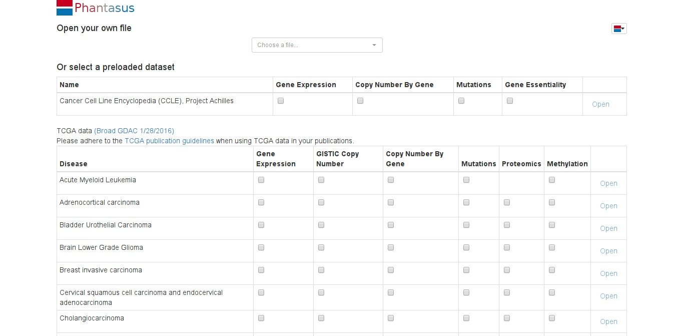
```

## Preparing the dataset for analysis

**Opening the dataset**

Let us open the dataset. To do this, select _GEO Datasets_ option
in _Choose a file..._ dropdown menu. There, a text field will appear
where `GSE53986` should be entered. Clicking the _Load_ button
(or pressing _Enter_ on the keyboard) will start the loading.
After a few seconds, the corresponding heatmap should appear. 

```{r, out.width = "750px", echo = FALSE}
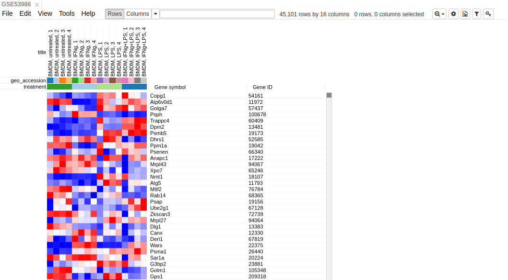
```

On the heatmap, the rows correspond to genes (or microarray probes).
The rows are annotated with _Gene symbol_ and _Gene ID_ annotaions
(as loaded from GEO database). 
Columns correspond to samples. 
They are annotated with titles, GEO sample accession identifiers and treatment field.
The annotations, such as treatment, are loaded from user-submitted GEO annotations 
(they can be seen, for example, in _Charateristics_
secion at https://www.ncbi.nlm.nih.gov/geo/query/acc.cgi?acc=GSM1304836).
We note that not for all of the datasets in GEO such proper annotations are supplied.

**Adjusting expression values**

By hovering at heatmap cell, gene expression values can be viewed.
The large values there indicate that the data is not log-scaled,
which is important for most types of gene expression analysis.


```{r, out.width = "500px", echo = FALSE}
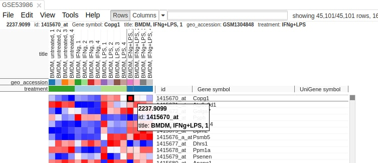
```

For the proper further analysis it is recommended to normalize the 
matrix. To normalize values go to _Tools/Adjust_ menu and
check _Log 2_ and _Quantile normalize_ adjustments.

```{r, out.width = "500px", echo = FALSE}
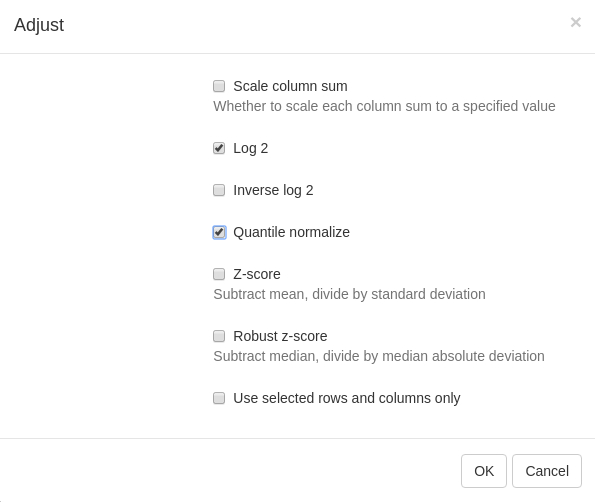
```

The new tab with adjusted values will appear. All operations that modify gene expression
matrix (such as adjustment, subsetting and several others) create a new tab. This allows 
to revert the operation by going back to one of the previous tabs.

**Removing duplicate genes**

Since the dataset is obtained with a mircroarray, a single gene can be represented by
several probes. This can be seen, for example, by sorting rows 
by _Gene symbol_ column (one click on column header), entering `Actb` in the search 
field and going to the first match by clicking down-arrow next to the field. 
There are five probes corresponding to Actb gene in the considered microarray.

```{r, out.width = "600px", echo = FALSE}
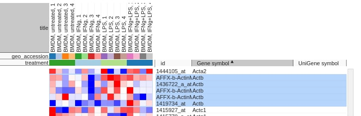
```

To simplify the analysis it is better to have one row per gene 
in the gene expression matrix. 
One of the easiest ways is to chose only one row that has
the maximal median level of expression
across all samples. Such method removes the noise of lowly-expressed probes.
Go to _Tools/Collapse_ and choose _Maximum Median Probe_ as the method and 
_Gene ID_ as the collapse field. 

```{r, out.width = "500px", echo = FALSE}
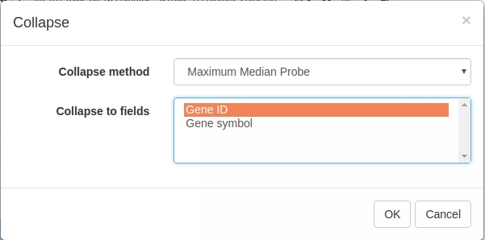
```

The result will be shown in a new tab. 


**Filtering lowly-expressed genes**

Additionally, lowly-epxressed genes can be filtered explicitly. It helps to reduce noise and increase
power of downstream analysis methods. 

First, we calculate mean expression of each gene using 
_Tools/Create Calculated Annotation_ menu. 
Enter `mean_expression` as the annotation name and `MEAN()` in the _Formula_ field
and click _OK_. The result will appear as an additional column in row annotations.

```{r, out.width = "500px", echo = FALSE}
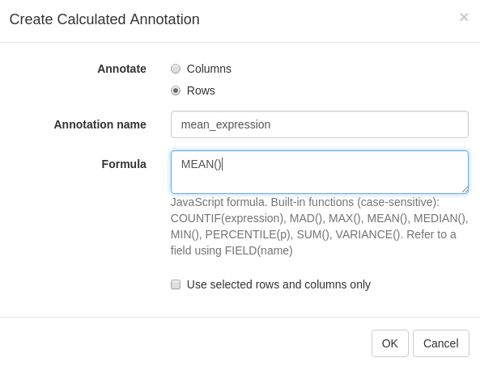
```


```{r, out.width = "600px", echo = FALSE}
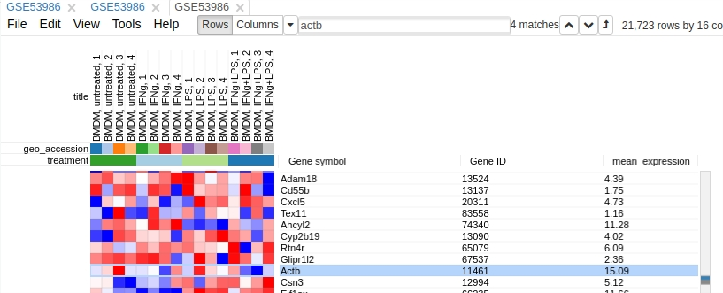
```

Now this annotation can be used to filter genes.
Open _Tools/Filter_ menu. Click _Add_ to add a new filter. Choose `mean_expression`
as a _Field_ for filtering. Then press _Switch to top filter_ button
and input the number of genes to keep. A good choice for a typical mammalian dataset
is to keep around 10--12 thousand most expressed genes. Filter is applied automatically,
so after closing the dialog with _Close_ button only the genes passing the filter 
will be displayed.


```{r, out.width = "500px", echo = FALSE}
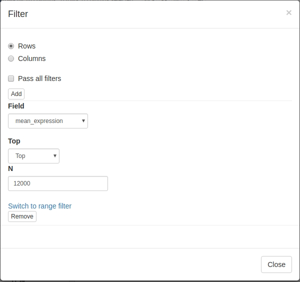
```


After filtering 12001 genes should be shown. The number is not equal to required 12000 genes due to
some of the genes having the same *mean_expression* value.

```{r, out.width = "500px", echo = FALSE}
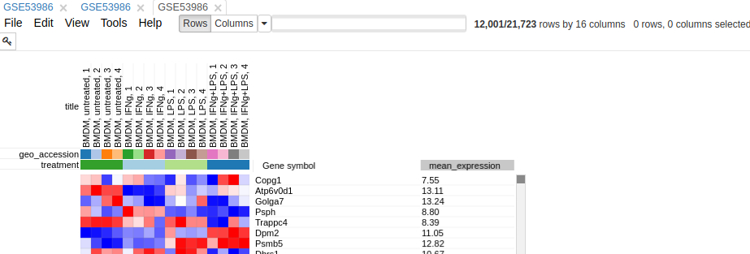
```

It is more convenient to extract these genes into a new tab. 
For this, select all genes (click on any gene and press _Ctrl+A_) and 
use _Tools/New Heat Map_ menu (or press _Ctrl+X_).

Now you have the tab with a fully prepared dataset for the further analysis. 
To easily distinguish it from other tabs, you can rename it
by right click on the tab and choosing _Rename_ option. Let us rename it to `GSE53986_norm`.

It is also useful to save the current result to be able to return to it later.
In order to save it use _File/Save Dataset_ menu. Enter an appropriate file name (e.g. `GSE53986_norm`)
and press `OK`. A file in text [GCT format](https://software.broadinstitute.org/cancer/software/gsea/wiki/index.php/Data_formats#GCT:_Gene_Cluster_Text_file_format_.28.2A.gct.29)
will be downloaded.

## Exploring the dataset

**PCA Plot**

One of the ways to asses quality of the dataset is to use
principal component analysis (PCA) method. This can be done
using _Tools/PCA Plot_ menu.

```{r, out.width = "550px", echo = FALSE}
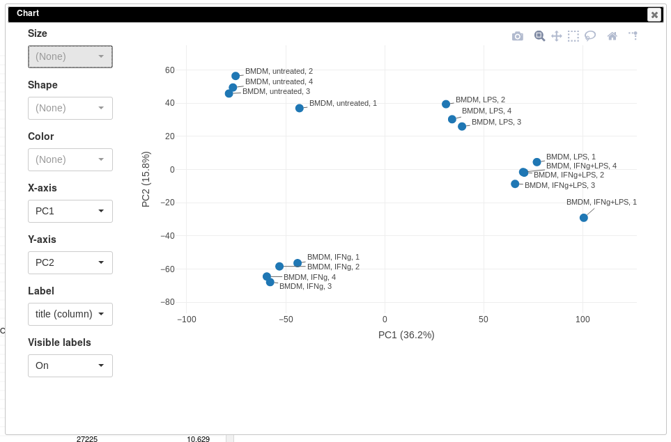
```

You can customize color, size and labels of points on the chart 
using values from annotation. Here we set color to come from
_treatment_ annotation.


```{r, out.width = "550px", echo = FALSE}
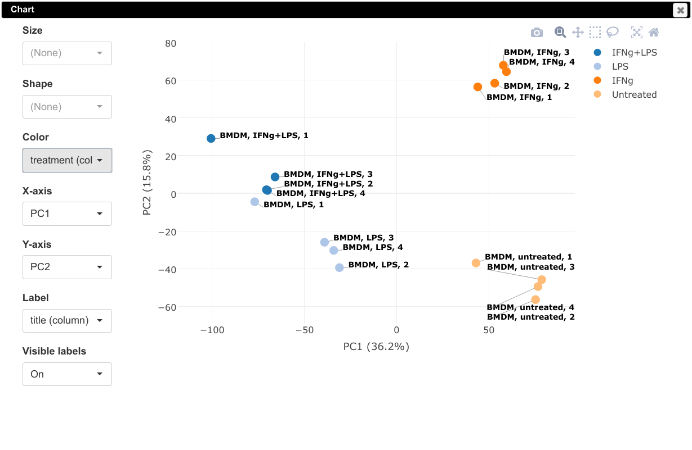
```

It can be seen that in this dataset the first replicates in each condition 
are outliers.

**K-means clustering**

Another useful dataset exploration tool is k-means clustering.
Use _Tools/k-means_ to cluster genes into 16 clusters.

```{r, out.width = "500px", echo = FALSE}
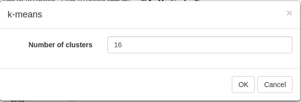
```

Afterwards, rows can be sorted by _clusters_ column. By using 
menu _View/Fit to window_ one can get a "bird's-eye view" on the dataset.
Here also one can clearly see outlying samples.

```{r, out.width = "600px", echo = FALSE}
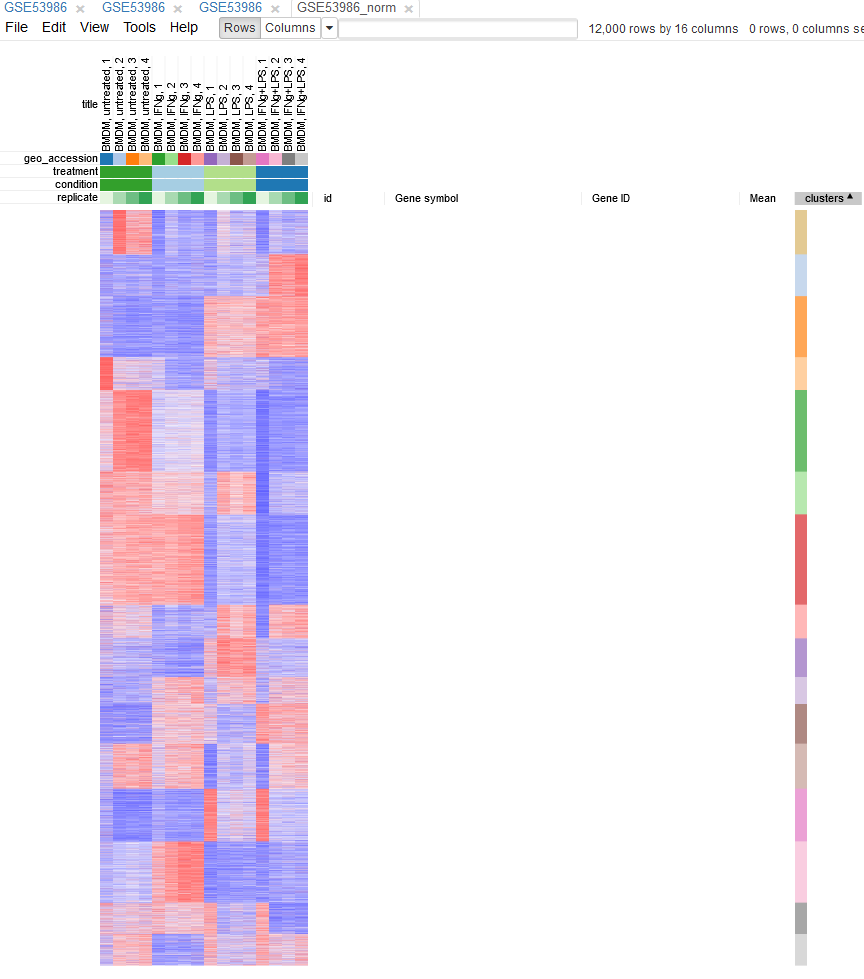
```

**Hierarchical clustering**

_Tool/Hierarchical clustering_ menu can be used to cluster 
samples and highlight outliers (and 
concordance of other samples) even further. 

```{r, out.width = "500px", echo = FALSE}
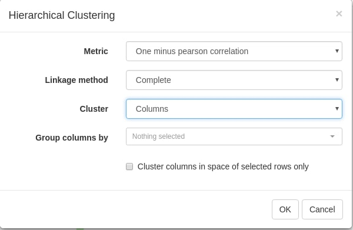
```

**Filtering outliers**

Now, when outliers are confirmed and easily viewed with the dendrogram 
from the previous step, you can select the good samples 
and extract them into another heatmap (by clicking _Tools/New Heat Map_ or pressing _Ctrl+X_).

```{r, out.width = "600px", echo = FALSE}
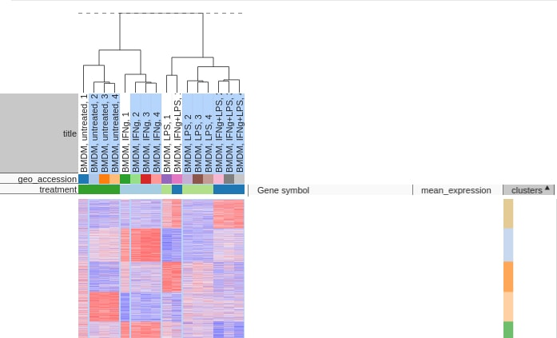
```

## Differential gene expression

**Apllying _limma_ tool**

Differential gene expression analysis can be carried out
with _Tool/limma_ menu. 
Choose _treatment_ as a _Field_, with
_Untreated_ and _LPS_ as classes. Clicking _OK_
will call differential gene expression analysis method 
with [*limma*](https://bioconductor.org/packages/limma) R package.

```{r, out.width = "500px", echo = FALSE}
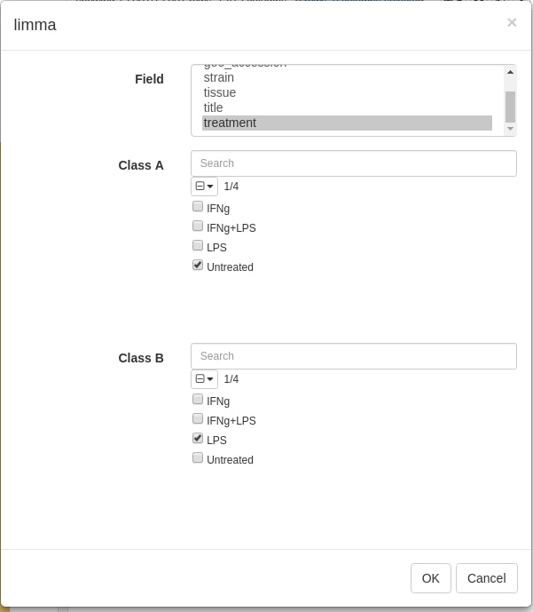
```

The rows can be ordered by decreasing *t*-statistic column to see which genes are the most
up-regulated upon LPS treatment. 

```{r, out.width = "600px", echo = FALSE}
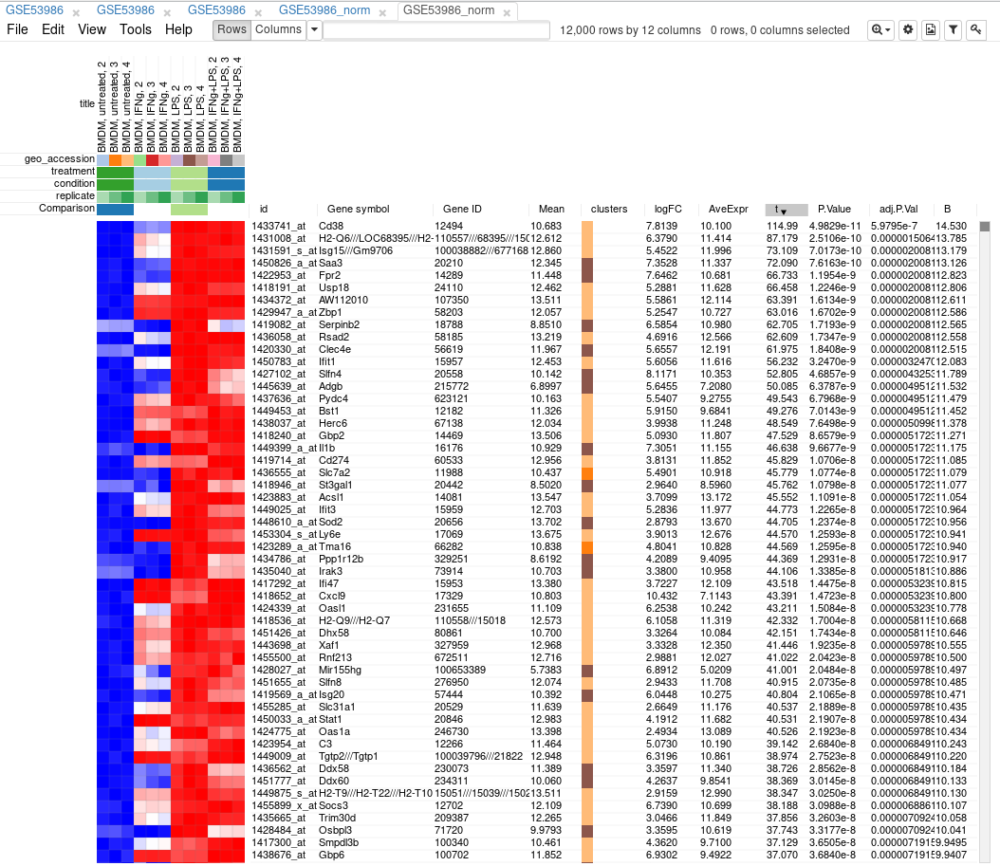
```

**Pahway analysis with Enrichr**

The results of differential gene expression can be used, for example,
for pathway enrichment analysis with online tools such as
[MSigDB](software.broadinstitute.org/gsea/msigdb/compute_overlaps.jsp)
or [Enrichr](http://amp.pharm.mssm.edu/Enrichr/).

For ease of use Enrichr is integrated into Phantasus. 
Open _Tools/Submit to Enrichr_ menu and select about top 200 genes up-regulated on LPS.
Also select _Gene symbol_ as the column with gene symbols.

```{r, out.width = "600px", echo = FALSE}
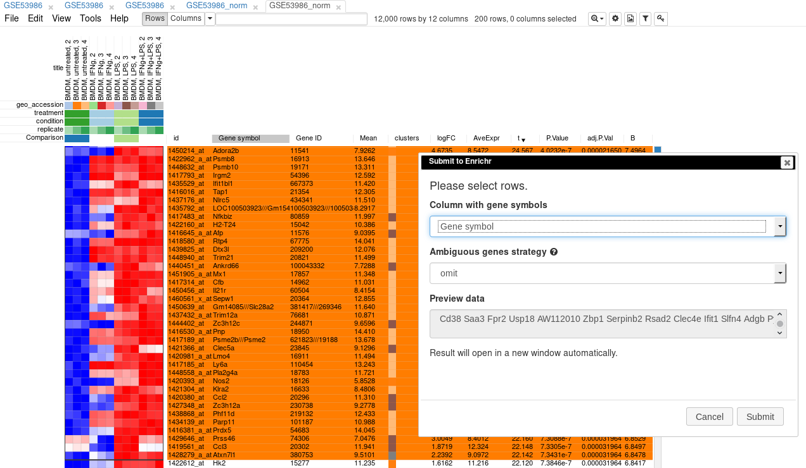
```


Clicking _OK_ will result in a new browser tab with Enrichr being opened with results
of pathway enrichment analysis.

```{r, out.width = "600px", echo = FALSE}
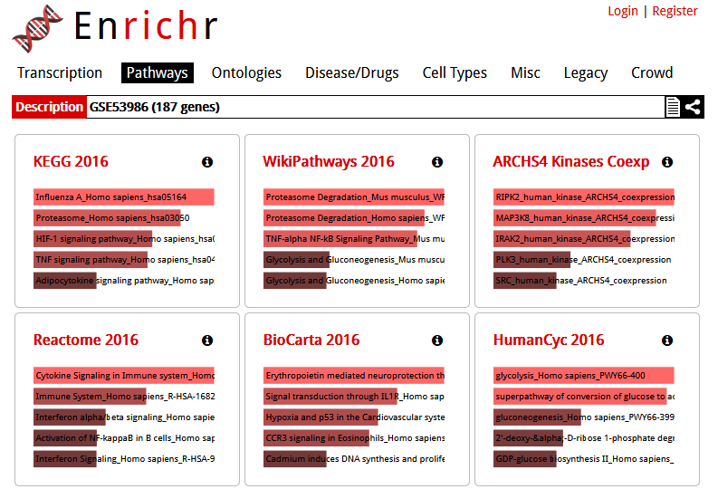
```


**Metabolic network analysis with Shiny GAM**

Another analysis integrated into Phantasus is metabolic network analysis
with [Shiny GAM](https://artyomovlab.wustl.edu/shiny/gam/).
After differential expression you can submit 
the table with _limma_ results using _Tools/Sumbit to Shiny GAM_ menu.

```{r, out.width = "300px", echo = FALSE}
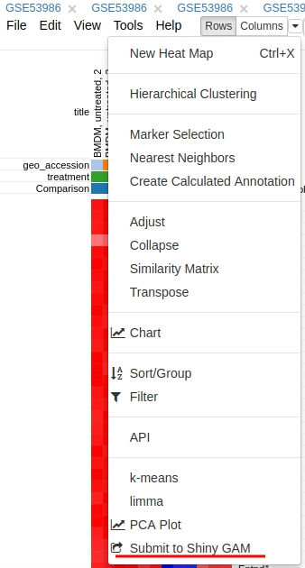
```

After successful submission, a new browser tab will be opened with _Shiny GAM_ interface
and the submitted data.

```{r, out.width = "600px", echo = FALSE}
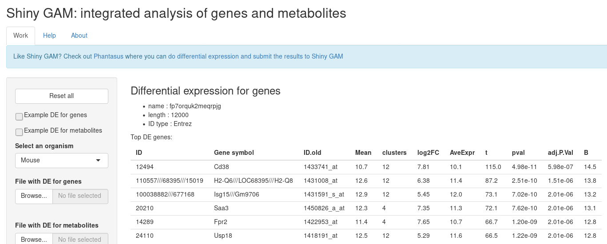
```

# Advanced usage

## Options for `servePhantasus`

You can customise serving of the application by specifying following parameters:

- `host` and `port` (by default: `"0.0.0.0"` and `8000`);
- `cacheDir` (by default: `tempdir()`) -- directory where downloaded datasets will be saved and reused in later sessions;
- `preloadedDir` (by default: `NULL`) -- directory with `ExpressionSet` objects encoded in rda-files, that can be quickly loaded to application by name (see section \@ref(preloaded-datasets));
- `openInBrowser` (by default `TRUE`).

## Loading dataset options

There are three ways to upload a dataset into application:

- As a file from:
    - computer;
    - URL;
    - Dropbox.
- By GEO identifier:
    - with _Open file_ interface;
    - with adding parameter `geo` to the link (_e.g._, http://localhost:8000/?geo=GSE27112).
- By an identifier of a dataset saved on the server (see section \@ref(preloaded-datasets))
    - with _Saved on server datasets_
    - with adding parameter `preloaded` to the link (_e.g._, http://localhost:8000/?preloaded=fileName)
    
You can either open the dataset from the main page, or if you are already looking at some datasets and don't want to lose your progress you can use _File/Open_ (_Ctrl+O_), choose _Open dataset in new tab_ and then select the open option.

```{r, out.width="500px", echo = FALSE}
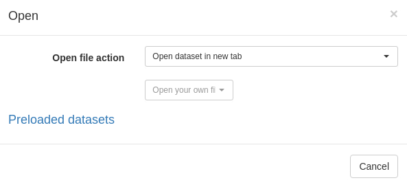
```

## Preloaded datasets 

Preloaded datasets is a feature that allows quick access to frequently-accessed datasets
or to share them inside the research group.

To store dataset on a server, on nead to save list `ess` of `ExpressionSet` objects
into an RData file with `.rda` extension into a directory as specified in `servePhantasus`.

Let us preprocess and save `GSE14308` dataset:

```{r, message=FALSE, cache=TRUE}
library(GEOquery)
library(limma)
gse14308 <- getGEO("GSE14308", AnnotGPL = TRUE)[[1]]
gse14308$condition <- sub("-.*$", "", gse14308$title)
pData(gse14308) <- pData(gse14308)[, c("title", "geo_accession", "condition")]
gse14308 <- gse14308[, order(gse14308$condition)]

fData(gse14308) <- fData(gse14308)[, c("Gene ID", "Gene symbol")]
exprs(gse14308) <- normalizeBetweenArrays(log2(exprs(gse14308)+1), method="quantile")

ess <- list(GSE14308_norm=gse14308)

preloadedDir <- tempdir()

save(ess, file=file.path(preloadedDir, "GSE14308_norm.rda"))
```

Next we can serve Phantasus with set `preloadedDir` option:

```{r, eval=F}
servePhantasus(preloadedDir=preloadedDir)
```

There you can either put `GSE14308_norm` name when using open option _Saved on server datasets_ or just 
open by specifying the name in URL: http://localhost:8000/?preloaded=GSE14308_norm.

```{r, out.width="650px", echo = FALSE}
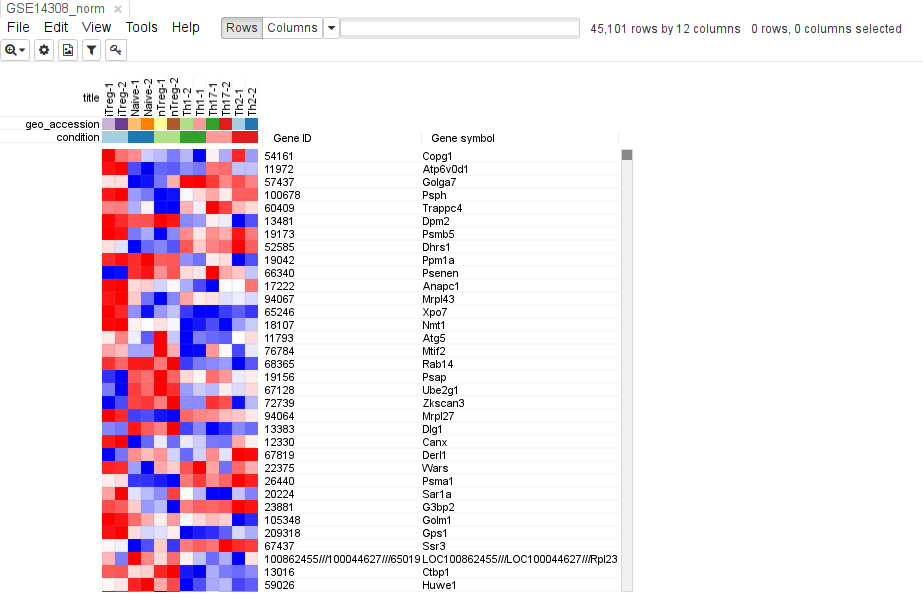
```

## Support for RNA-seq datasets

Phantasus supports loading RNA-seq datasets from GEO using 
gene expression counts as computed by [ARCHS4 project](http://amp.pharm.mssm.edu/archs4/index.html).
To make it work one need to download gene level expression from 
the [Download](http://amp.pharm.mssm.edu/archs4/download.html) section. The
downloaded files `human_matrix.h5` and `mouse_matrix.h5` should be placed 
into Phantasus cache folder.

# Feedback

You can see known issues and submit yours at GitHub:
(https://github.com/ctlab/phantasus/issues)

# Acknowledgments

The authors are very thankful to Joshua Gould for developing Morpheus.
